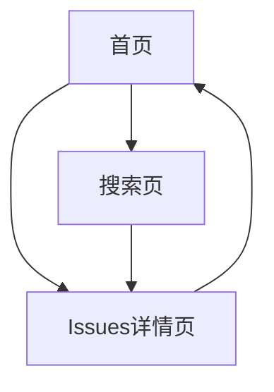

# AI-issues-finder 产品需求文档

## 1. 产品概述

AI-issues-finder是一个智能GitHub Issues推荐平台，通过实时爬取GitHub仓库的issues数据，结合AI技术进行智能评估和排序，为开发者推荐适合的开源项目贡献机会。

该平台解决了开发者难以找到合适开源项目贡献机会的问题，特别是新手开发者不知道从哪里开始参与开源项目的痛点。通过智能评估系统，平台能够根据难易程度、项目活跃度等指标推荐最适合的issues。

目标是成为开发者参与开源项目的首选入口平台，提升开源社区的参与度和贡献质量。

## 2. 核心功能

### 2.1 用户角色

| 角色 | 注册方式 | 核心权限 |
|------|----------|----------|
| 普通用户 | 无需注册，直接访问 | 可浏览推荐issues、查看AI分析报告 |

### 2.2 功能模块

我们的AI-issues-finder平台包含以下主要页面：

1. **首页**：hero展示区、导航菜单、推荐issues列表、筛选器
2. **Issues详情页**：issue详细信息、AI分析报告、相关链接
3. **搜索页**：高级搜索、筛选条件、搜索结果列表

### 2.3 页面详情

| 页面名称 | 模块名称 | 功能描述 |
|----------|----------|----------|
| 首页 | Hero展示区 | 展示平台介绍、核心价值主张，包含搜索入口 |
| 首页 | 导航菜单 | 提供页面导航、筛选快捷入口 |
| 首页 | 推荐Issues列表 | 显示经过AI评估排序的推荐issues，包含难度标签、star数、语言标签 |
| 首页 | 智能筛选器 | 按难度等级、编程语言、star数范围、更新时间筛选issues |
| Issues详情页 | Issue信息展示 | 显示issue标题、描述、标签、仓库信息、创建时间等 |
| Issues详情页 | AI分析报告 | 调用魔搭API生成问题总结、技术分析、解决方案建议 |
| Issues详情页 | 相关操作 | 跳转到GitHub原始issue、收藏、分享功能 |
| 搜索页 | 高级搜索 | 支持关键词、仓库名、标签等多维度搜索 |
| 搜索页 | 搜索结果 | 展示搜索匹配的issues列表，支持排序 |

## 3. 核心流程

用户访问首页，浏览系统推荐的精选issues列表。用户可以通过筛选器按难度、语言、star数等条件筛选感兴趣的issues。点击具体issue进入详情页，查看详细信息和AI生成的分析报告。用户也可以通过搜索页面主动搜索特定类型的issues。

## 4. 用户界面设计

### 4.1 设计风格

- 主色调：深蓝色(#1a365d)和亮蓝色(#3182ce)
- 辅助色：灰色(#718096)和绿色(#38a169)
- 按钮样式：圆角现代风格，带有悬停效果
- 字体：主要使用Inter字体，代码部分使用Fira Code
- 字体大小：标题24px，正文16px，小字12px
- 布局风格：卡片式设计，顶部导航栏
- 图标风格：使用Heroicons线性图标

### 4.2 页面设计概览

| 页面名称 | 模块名称 | UI元素 |
|----------|----------|--------|
| 首页 | Hero展示区 | 渐变背景，大标题，搜索框，CTA按钮 |
| 首页 | 推荐Issues列表 | 卡片式布局，难度徽章，star图标，语言标签 |
| 首页 | 智能筛选器 | 下拉选择器，滑动条，标签选择 |
| Issues详情页 | Issue信息展示 | 面包屑导航，标题区域，描述卡片，元信息标签 |
| Issues详情页 | AI分析报告 | 加载动画，分段展示，代码高亮 |
| 搜索页 | 高级搜索 | 搜索表单，筛选面板，结果统计 |

### 4.3 响应式设计

产品采用移动优先的响应式设计，支持桌面端和移动端访问，针对触摸交互进行优化。